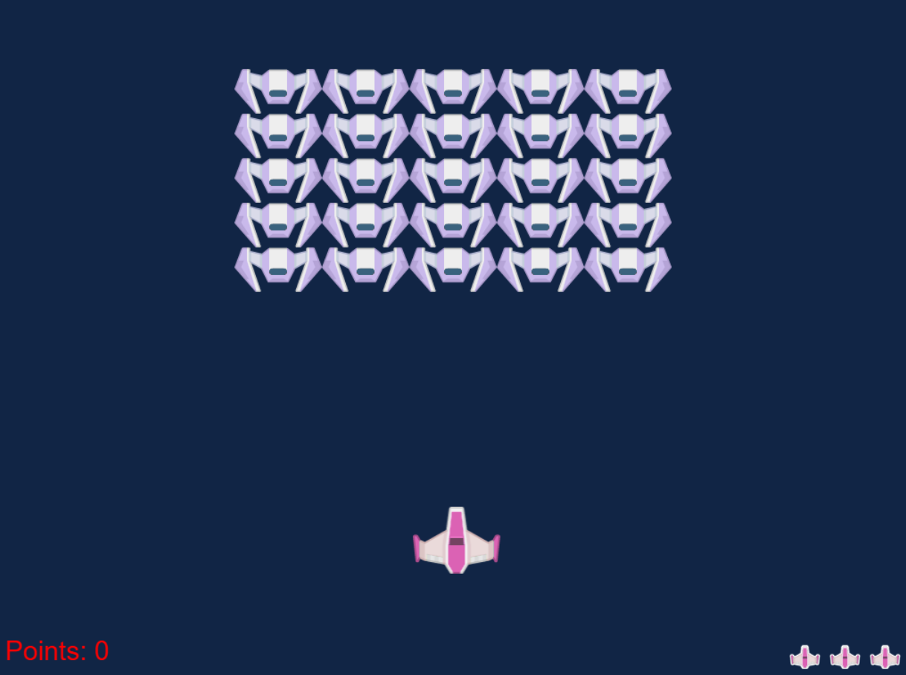
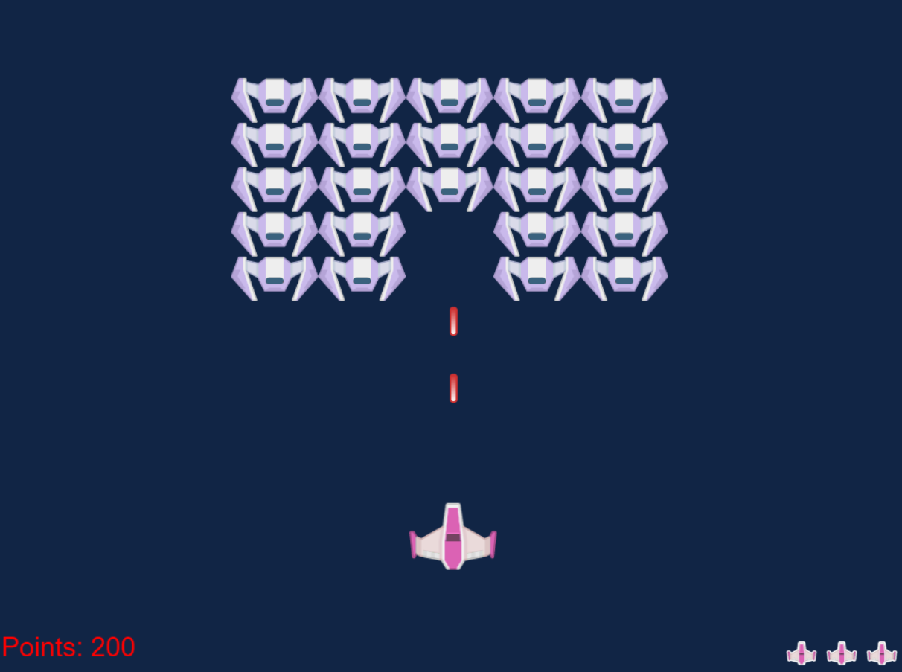

# C2800-web-game
**A Space Invaders web game based on [Microsoft Web Dev for Beginners Tutorial #6]([url](https://github.com/microsoft/Web-Dev-For-Beginners/tree/main/6-space-game))**

### Running the Game
The game can be accessed at the following live link: https://kind-island-0553a760f.6.azurestaticapps.net/.

If the live link is not working, it is possible to run the game from this repository by creating a codespace on main. Once on the codespace, enter “npm start” in the terminal and follow the link that pops up. It will run on port 5000.

### Keybinds:
**Arrow Keys** to move the spaceship up, down, left, and right  
**Spacebar** fires a laser upwards towards the enemies (has a cooldown on initial loading of the game and while playing to prevent spam clicking)  
**Enter** to restart the game when on a victory/loss screen